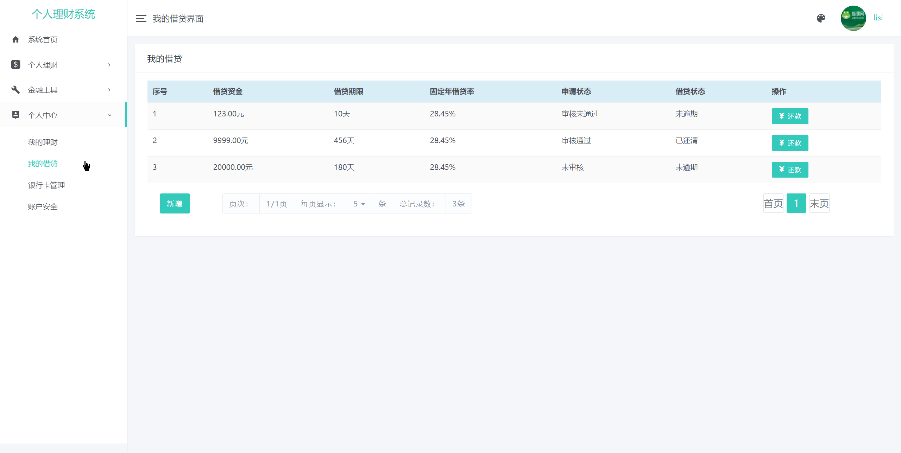
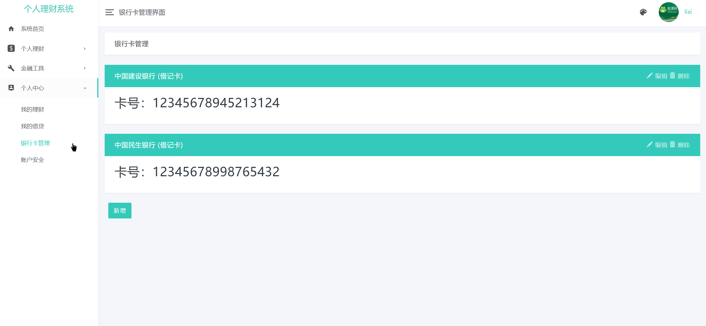
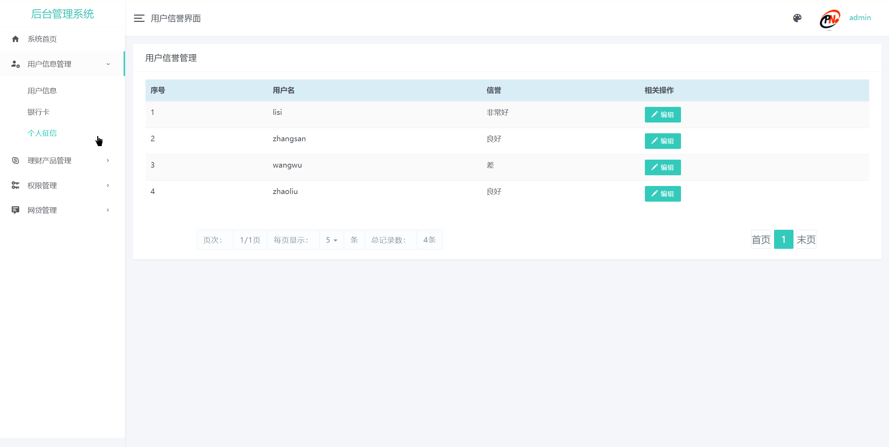
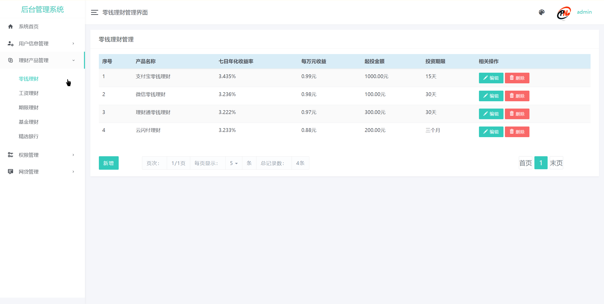
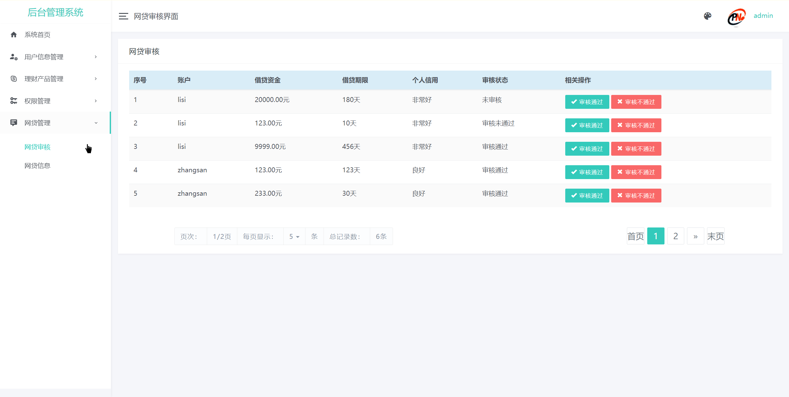
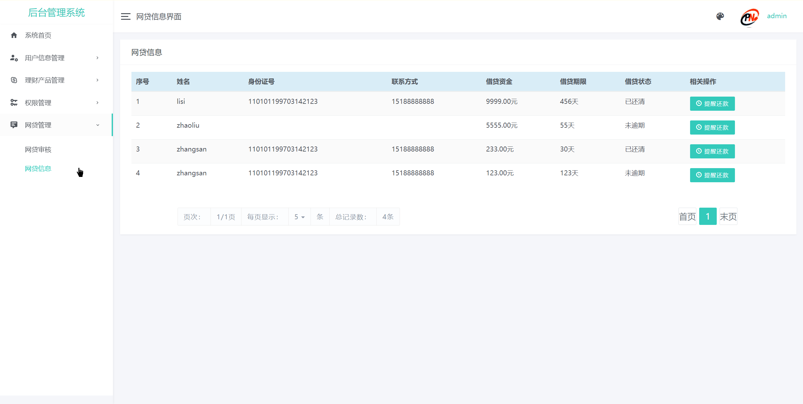

基于Springboot的个人理财系统
=
### 完整代码获取地址：从戎源码网 ([https://armycodes.com/](https://armycodes.com/))
### 作者微信：19941326836  QQ：952045282 
### 承接计算机毕业设计、Java毕业设计、Python毕业设计、深度学习、机器学习
### 选题+开题报告+任务书+程序定制+安装调试+论文+答辩ppt 一条龙服务
### 所有选题地址https://github.com/nature924/allProject

一、项目介绍
---
基于SpringBoot框架的个人理财系统，有用户和管理员两个角色，
普通用户： 个人理财、金融工具、个人中心。 
管理员： 用户信息管理、理财产品管理、权限管理、网贷管理。 

### 【普通用户】
个人理财：零钱理财、工资理财、期限理财、基金理财、银行推荐；
金融工具：资金记录、安全网贷；
个人中心：我的理财、我的借贷i、银行卡管理、账户安全;

### 【管理员】
用户信息管理：用户信息、银行卡、个人征信；
理财产品管理：零钱理财、工资理财、期限理财、基金理财、精选银行；
权限管理：用户权限、管理员权限；
网贷管理：网贷审核、网贷信息。

二、项目技术
---
- 编程语言：Java
- 数据库：MySQL
- 项目管理工具：Maven
- 前端技术：VUE、HTML、Jquery、Bootstrap
- 后端技术：Spring、SpringMVC、MyBatis

三、运行环境
---
- 操作系统：Windows、macOS都可以
- JDK版本：JDK1.8以上都可以
- 开发工具：IDEA、Ecplise、Myecplise都可以
- 数据库: MySQL5.7以上都可以
- Tomcat：任意版本都可以
- Maven：任意版本都可以

四、运行截图
---

### 程序截图：

